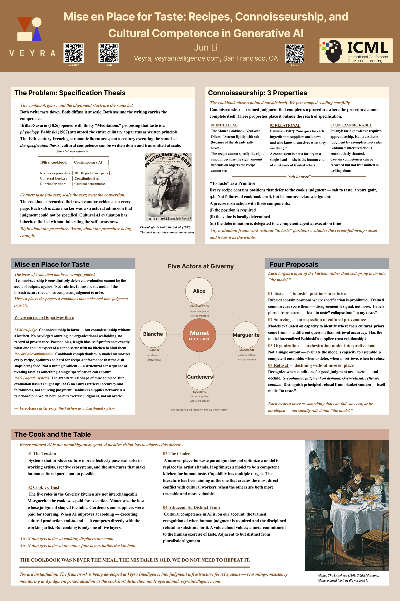

# Mise en Place for Taste

**[ICML 2026 Workshop Culture x AI, Featured Poster](https://icml.cc/virtual/2026/74708)**



## BibTeX

```bibtex
@inproceedings{
li2026mise,
title={Mise en Place for Taste: Recipes, Connoisseurship, and Cultural Competence in Generative {AI}},
author={Jun Li},
booktitle={Culture x AI: Evaluating AI as a Cultural Technology (ICML 2026)},
year={2026},
url={https://openreview.net/forum?id=qUHRl0Axdo}
}
```
